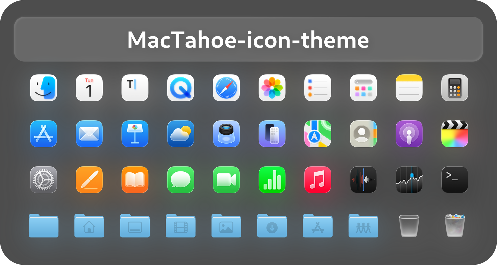

 MacTahoe Icon Theme
======

MacOS Tahoe like icon theme for linux desktops

### Donate

If you like my project, you can buy me a coffee:

## Install tips

Usage:  `./install.sh`  **[OPTIONS...]**

|  OPTIONS:           | |
|:--------------------|:-------------|
|-d, --dest           | Specify theme destination directory (Default: $HOME/.local/share/icons)|
|-n, --name           | Specify theme name (Default: MacTahoe)|
|-t, --theme          | Specify theme color variant(s) [default/purple/pink/red/orange/yellow/green/grey/all] (Default: blue)|
|-b, --bold           | Install bold panel icons version|
|-r,--remove,-u,--uninstall | Uninstall (remove) icon themes|
|-h, --help           | Show this help|

> **Note for snaps:** To use these icons with snaps, the best way is to make a copy of the application's .desktop located in `/var/lib/snapd/desktop/applications/name-of-the-snap-application.desktop` into `$HOME/.local/share/applications/`. Then use any text editor and change the "Icon=" to "Icon=name-of-the-icon.svg"

> For more information, run: `./install.sh --help`

> Bold version suggested use in `High resolution display` like 4k display with 200% scale!

## Requirement
You can use this with:

### GTK theme

MacTahoe-gtk-theme: https://github.com/vinceliuice/MacTahoe-gtk-theme

