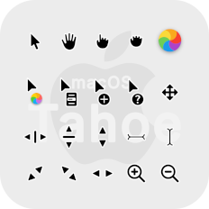
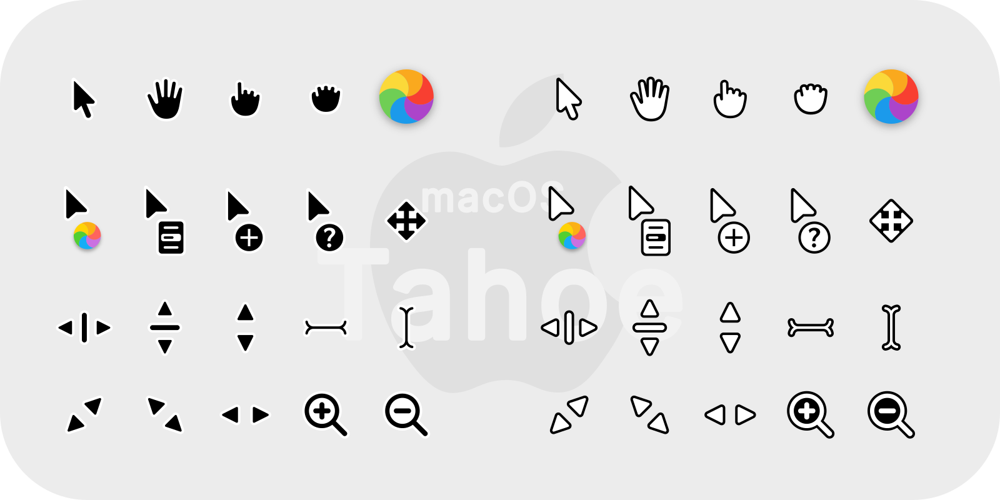

 Qogir cursors
===

MacOS Tahoe like cursor theme for linux desktops.

### Donate

If you like my project, you can buy me a coffee:

<span class="paypal"><a href="https://www.paypal.me/vinceliuice" title="Donate to this project using Paypal"></a></span>


## Installation

<details>
<summary>Install for only the current user</summary>

<h2>Please choose either automated or manual installation.</h2>

<details>

<summary>Automated installation</summary>

Simply clone this git repository and while in the `/cursors` directory run the following command

```bash
./install.sh
```

</details>

<details>

<summary>Manual Installation</summary>

Simply copy the pre-compiled theme (located at `/dist`) to your `~/.icons` directory.

</details>

</details>

<br>

<details>
    <summary>Install system-wide (for all users)</summary>

Simply clone this git repository and while in the `/cursors` directory run the following command

```bash
sudo ./install.sh
```

</details>

<br>

Then select the theme newly installed theme with your preferred desktop tools.
e.g: Gnome Tweaks

## Building from source

You'll find everything you need to build and modify this cursor set in
the `src/` directory. To build the xcursor theme from the SVG source
run:

```bash
./build.sh
```

By default, cursors are built without any shadows. You can enable them with:

```bash
./build.sh --with-shadow
```

This will generate the pixmaps and appropriate aliases.
The freshly compiled cursor theme will be located in `dist/`

## Preview



## Recommendations
This cursor theme works well with:

### GTK themes
MacTahoe-gtk-theme: https://github.com/vinceliuice/MacTahoe-gtk-theme

### Icon themes
MacTahoe-icon-theme: https://github.com/vinceliuice/MacTahoe-icon-theme